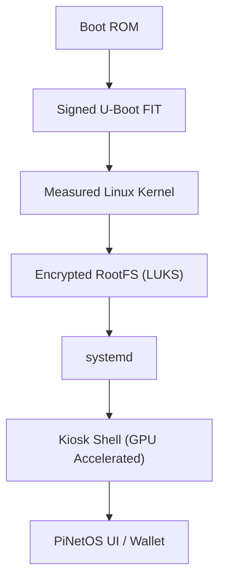

# PiNetOS Enterprise

**Secure Edge Operating System for Raspberry Pi**

PiNetOS is a hardened, appliance-grade Linux OS purpose-built for Raspberry Pi devices, combining secure boot, encrypted storage, signed OTA updates, kiosk UX, wallet-grade key handling, and fleet management into a turnkey system.

  

## 🏗 System Architecture



## 🔐 Security Features

| Feature | Status | Description |
| :--- | :--- | :--- |
| **Secure Boot** | ✅ | U-Boot FIT signing via hardware root of trust |
| **Measured Boot** | ✅ | TPM 2.0 PCR sealing for chain of trust |
| **Disk Encryption** | ✅ | Full LUKS encryption for root & data partitions |
| **Signed OTA** | ✅ | Cryptographically verified updates (A/B partition) |
| **Rollback** | ✅ | Atomic automatic rollback on update failure |
| **Kiosk Lockdown** | ✅ | No TTY escape, USB HID whitelist, No local shell |

## 🛠 Build Instructions

**Requirements:** Raspberry Pi OS (Bookworm 64-bit), Docker, 30GB Disk.

```bash
# 1. Install Dependencies
sudo apt update
sudo apt install -y git curl rsync xz-utils parted qemu-user-static \
debootstrap zerofree genisoimage squashfs-tools cryptsetup \
docker.io openssl tpm2-tools chromium-browser network-manager

# 2. Clone Generator
git clone https://github.com/RaspberryPiFoundation/raspi-image-gen
chmod +x build.sh install.sh

# 3. Build Signed Image
sudo ./build.sh
```

**Artifact:** `output/PiNetOS.img`

## 📦 Directory Structure

```text
PiNetOS/
├── build.sh                 # Main build orchestrator
├── images/pinetos/          # OS Configuration
│   ├── config               # Distro variables
│   ├── stage0/              # Secure Boot (U-Boot)
│   ├── stage1/              # LUKS Encryption
│   ├── stage2/              # GPU Desktop Stack
│   ├── stage3/              # Kiosk Lockdown
│   ├── stage4/              # Wallet Subsystem
└── tools/                   # Utilities (Signer, Flasher)
```

## 🧠 Virtual Product Design (VPD)

### Problem Statement
Raspberry Pi devices are increasingly used for kiosks, financial terminals, and edge compute, but standard OS distros lack enterprise-grade security. PiNetOS solves this by delivering a hardened, appliance-grade Linux OS.

### User Goals
1.  **Deploy Securely:** Prevent tampering via Secure Boot & TPM.
2.  **Reliable Updates:** A/B OTA with automatic rollback.
3.  **Fleet Management:** Remote wipe, reboot, and monitoring.
4.  **Web3 Ready:** Hardware-backed wallet key storage.

### Success Metrics
*   **Boot Time:** < 6 seconds (Pi 5)
*   **OTA Failure:** < 0.1%
*   **Recovery:** > 99% Success Rate

---

*Built for the Decentralized Edge.*